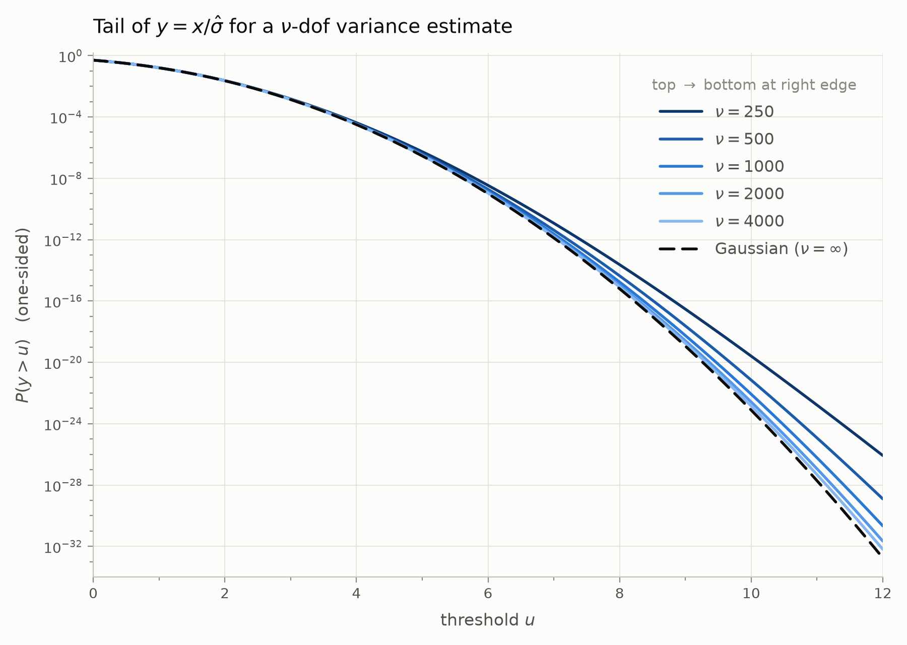

# Tails of $x/\hat\sigma$ when $\hat\sigma$ is estimated from finitely many samples

## Scope

Reference note, not a coding task. Fixes notation for "signal-to-noise computed
against an *estimated* variance", records the exact distribution, and quantifies
how much the far tail is inflated relative to a Gaussian. The point of interest
is the tail: a search that thresholds at $u = 8$ or $10$ cares about the
inflation factor at $u$, not about the variance or kurtosis of the bulk.

Reproduce every number and the figure with `python3 misc/student_t_tails/student_t_tails.py`.

## Notation

| symbol | meaning |
|---|---|
| $x$ | the statistic of interest, $x \sim N(0, \sigma^2)$, mean known to be zero |
| $\sigma^2$ | the true (unknown) variance of $x$ |
| $z_1 \dots z_n$ | the samples used to estimate the variance, $z_i \sim N(0,\sigma^2)$ i.i.d. |
| $\hat\sigma^2$ | the variance estimate built from the $z_i$ |
| $\nu$ | degrees of freedom of $\hat\sigma^2$ (see below) |
| $y$ | the studentized statistic, $y = x/\hat\sigma$ |
| $u$ | a threshold applied to $y$ (the x-axis of the figure) |
| $S_\nu(u)$ | one-sided tail, $S_\nu(u) = P(y > u) = 1 - \mathrm{CDF}_\nu(u)$ |
| $S_\infty(u)$ | the Gaussian reference, $S_\infty(u) = \tfrac12\,\mathrm{erfc}(u/\sqrt2)$ |

Degrees of freedom: $\nu$ is defined by $\hat\sigma^2 = (\sigma^2/\nu)\,\chi^2_\nu$,
i.e. by the *shape* of the estimator's distribution, not by the sample count as
such. For the two common estimators:

* mean known to be zero, $\hat\sigma^2 = \frac{1}{n}\sum_i z_i^2$: then $\nu = n$.
* mean estimated from the same samples,
  $\hat\sigma^2 = \frac{1}{n-1}\sum_i (z_i - \bar z)^2$: then $\nu = n - 1$.

The scale of $\hat\sigma^2$ (whether it is unbiased, or normalized by $n$ vs
$n-1$) does *not* matter here: any constant rescaling of $\hat\sigma$ rescales
$y$, so it only shifts the threshold, and I take $\hat\sigma^2$ to be unbiased so
that $u$ can be read as "sigmas".

## The distribution

With $x$ **independent** of the $z_i$,

$$ y \;=\; \frac{x}{\hat\sigma} \;=\; \frac{x/\sigma}{\sqrt{\chi^2_\nu/\nu}} \;\sim\; t_\nu $$

-- Student's $t$ with $\nu$ degrees of freedom. The unknown $\sigma$ cancels,
which is the entire purpose of the construction. Concretely: $n = 1000$ samples
with the mean known gives $t_{1000}$; with the mean estimated, $t_{999}$.

Bulk moments understate the effect badly and should not be used to reason about
thresholds: at $\nu = 1000$, $\mathrm{Var}(y) = \nu/(\nu-2) = 1.002$ and the
excess kurtosis is $6/(\nu-4) = 0.006$. Both are negligible; the tail is not.

## The figure

Curves are $S_\nu(u)$ for $\nu \in \{250, 500, 1000, 2000, 4000\}$ plus the
Gaussian $\nu \to \infty$ limit (dashed). Read the vertical gap between a solid
curve and the dashed one as the tail inflation factor at that threshold. The
bundle is visually indistinguishable out to $u \approx 5$ and fans out from
there; by $u = 12$ the $\nu = 250$ curve sits more than six decades above the
Gaussian, and $\nu = 500$ about four.

## Tail probabilities

One-sided $S_\nu(u)$, and the inflation factor for the worst case shown:

| $u$ | Gaussian | $\nu=250$ | $\nu=500$ | $\nu=1000$ | $\nu=2000$ | $\nu=4000$ | $S_{250}/S_\infty$ |
|---:|---:|---:|---:|---:|---:|---:|---:|
| 4  | 3.17e-05 | 4.17e-05 | 3.65e-05 | 3.40e-05 | 3.28e-05 | 3.22e-05 | 1.32 |
| 5  | 2.87e-07 | 5.40e-07 | 3.97e-07 | 3.38e-07 | 3.12e-07 | 2.99e-07 | 1.88 |
| 6  | 9.87e-10 | 3.44e-09 | 1.90e-09 | 1.38e-09 | 1.17e-09 | 1.07e-09 | 3.49 |
| 7  | 1.28e-12 | 1.17e-11 | 4.14e-12 | 2.34e-12 | 1.74e-12 | 1.49e-12 | 9.17 |
| 8  | 6.22e-16 | 2.33e-14 | 4.37e-15 | 1.71e-15 | 1.04e-15 | 8.08e-16 | 37.4 |
| 9  | 1.13e-19 | 2.92e-17 | 2.36e-18 | 5.57e-19 | 2.56e-19 | 1.71e-19 | 259 |
| 10 | 7.62e-24 | 2.53e-20 | 6.93e-22 | 8.34e-23 | 2.62e-23 | 1.43e-23 | 3.32e+03 |
| 11 | 1.91e-28 | 1.63e-23 | 1.18e-25 | 6.00e-27 | 1.14e-27 | 4.76e-28 | 8.53e+04 |
| 12 | 1.78e-33 | 8.37e-27 | 1.24e-29 | 2.16e-31 | 2.18e-32 | 6.41e-33 | 4.71e+06 |

Two-sided tails are $2 S_\nu(u)$, so every ratio in the table is unchanged.

The same information as a threshold shift -- the $u_\nu$ that reproduces the
false-alarm rate a Gaussian analysis would attribute to $u$:

| Gaussian $u$ | $\nu=250$ | $\nu=500$ | $\nu=1000$ | $\nu=2000$ | $\nu=4000$ |
|---:|---:|---:|---:|---:|---:|
| 5  | 5.133  | 5.066  | 5.033  | 5.016  | 5.008  |
| 6  | 6.229  | 6.113  | 6.056  | 6.028  | 6.014  |
| 8  | 8.550  | 8.267  | 8.132  | 8.065  | 8.033  |
| 10 | 11.102 | 10.527 | 10.258 | 10.128 | 10.063 |
| 12 | 13.972 | 12.925 | 12.449 | 12.221 | 12.110 |

The threshold shift is small in absolute terms (a few percent) precisely because
the tail is steep -- which is also why the *probability* ratio in the first table
is large. These are two views of the same fact, and the probability view is the
one that matters when a false-alarm budget is being set.

## Asymptotics

Two closed forms, both checked numerically against `scipy.stats.t` by
`student_t_tails.py`:

**Threshold shift (Cornish-Fisher).** For tail probability $p$ with Gaussian
quantile $z_p$,

$$ u_\nu \;=\; z_p + \frac{z_p^3 + z_p}{4\nu} + \frac{5z_p^5 + 16z_p^3 + 3z_p}{96\nu^2} + O(\nu^{-3}) $$

This reproduces the second table to all three decimals shown for
$\nu \ge 500$; at $\nu = 250$ it is still good to $\pm 0.02$ at $u = 12$
(13.952 vs the exact 13.972). The leading term alone gives the useful mnemonic
$u_\nu \approx u\left[1 + \frac{u^2+1}{4\nu}\right]$.

**Tail inflation.** To leading order,

$$ \ln\frac{S_\nu(u)}{S_\infty(u)} \;\approx\; \frac{u^4}{4\nu} $$

so the inflation factor is $\exp[u^4/(4\nu)]$. The scaling is the headline: it is
quartic in the threshold and only linear in $\nu$, so pushing the threshold out
costs far more than the naive $u^2/\nu$ intuition suggests. Signed error of the
approximation (percent by which $u^4/(4\nu)$ over- or under-states the exact
$\ln$ ratio):

| $u$ | $\nu=250$ | $\nu=500$ | $\nu=1000$ | $\nu=2000$ | $\nu=4000$ |
|---:|---:|---:|---:|---:|---:|
| 6  | +3.7%  | -0.7%  | -3.0% | -4.1% | -4.6% |
| 8  | +13.1% | +5.1%  | +1.1% | -1.0% | -2.0% |
| 10 | +23.3% | +10.9% | +4.5% | +1.3% | -0.3% |
| 12 | +35.0% | +17.1% | +8.0% | +3.3% | +1.0% |

The error is not a function of $u^4/(4\nu)$ alone -- at fixed $u^4/(4\nu)$ it
shrinks as $\nu$ grows -- but the qualitative rule holds: the approximation is
good to a few percent exactly where it says the correction is mild, and a
conservative over-estimate where it says the correction is large. Once
$u^4/(4\nu)$ exceeds about 2, use the tables above (or the script) rather than
the formula.

## How many degrees of freedom are enough?

Inverting the inflation formula: to hold the tail probability at threshold $u$
within a factor $1+\epsilon$ of Gaussian,

$$ \nu \;\gtrsim\; \frac{u^4}{4\ln(1+\epsilon)} $$

| threshold $u$ | $\nu$ for 10% accuracy | $\nu$ for a factor of 2 |
|---:|---:|---:|
| 5  | 1.6e+03 | 2.3e+02 |
| 6  | 3.4e+03 | 4.7e+02 |
| 8  | 1.1e+04 | 1.5e+03 |
| 10 | 2.6e+04 | 3.6e+03 |
| 12 | 5.4e+04 | 7.5e+03 |

Read off the practical statement: $\nu \sim 10^3$ is ample for a $5\sigma$ or
$6\sigma$ threshold and marginal at $8\sigma$, but a $10\sigma$ threshold needs
$\nu \sim 3 \times 10^4$ before the Gaussian false-alarm rate is even within a
factor of 2. At the low end of the range plotted, $\nu = 250$, the correction is
already a factor of 37 at $u = 8$ and $3 \times 10^3$ at $u = 10$. Any threshold
quoted in "sigmas" far out in the tail is a statement about $\nu$ as much as
about the data.

## Caveat: $x$ must be independent of the variance estimate

Everything above needs $x$ independent of $z_1 \dots z_n$. Two ways this fails,
with opposite consequences:

**$x$ is one of the samples.** If $y = (x_i - \bar z)/\hat\sigma$ with
$\hat\sigma$ built from the same $n$ samples including $x_i$, then $y$ is not
$t$-distributed at all. It is a rescaled Beta: $\frac{n}{(n-1)^2}y^2 \sim
\mathrm{Beta}(\tfrac12, \tfrac{n-2}{2})$ (Monte Carlo check in the script,
KS $p = 0.99$ at $n = 50$), with **bounded** support
$|y| \le (n-1)/\sqrt{n}$. So the tail is truncated rather than inflated, and for
large $n$ the interesting range of $u$ is far inside the bound and the
distribution is close to Gaussian -- the opposite error from the $t$ correction,
and much smaller. This is the "studentized residual" case.

**$\hat\sigma$ is estimated from data that contains signal.** Then $\hat\sigma$
is biased high where the signal is, $y$ is biased low, and no amount of $\nu$
fixes it. This is a separate (and usually larger) effect than anything in this
note, and is not modelled by $t_\nu$.

The realistic middle case -- $\hat\sigma$ estimated from a neighbouring block of
samples that is correlated with, but not identical to, the block containing $x$
-- sits between the two. $t_\nu$ with $\nu$ set to the *effective* number of
independent samples is the natural approximation, but the effective $\nu$ has to
come from the correlation structure of the estimator, not from the raw sample
count.

## Files

* `student_t_tails.py` -- generates the figure and prints every table
  above, plus the two accuracy checks and the Monte Carlo check of the
  studentized-residual claim.
* `figs/student_t_tails.png`, `.pdf` -- the figure.
