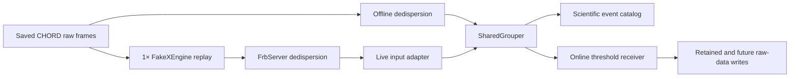

# Controlled CHORD experiment: online and offline

The controlled experiment sends one saved observation through the offline and
online pipelines, using the same peak-finding and grouping implementation. It
answers two separate questions:

1. Do both modes recover the same injected bursts, source candidates and grouping
   memberships with compatible measured properties?
2. Does online early triggering request raw-data capture before the earliest
   part of a high-DM burst leaves the transient buffer?

The offline run is the scientific reference. It can process the archive as fast
as possible and does not simulate an expiring buffer. The online run transmits
the identical packed data at the observing rate and exercises a real local
`FakeXEngine`, `FrbServer`, live grouper and file writer. The classifier is
explicitly bypassed by a threshold policy. No injection truth enters that policy.

This is a correctness and online-feasibility experiment with two beams. It does
not measure production CHORD capacity, detection completeness, classifier quality
or performance under realistic RFI. Measured outcomes belong in the generated
validation report; the configuration numbers below are planned inputs and budgets.

The completed local run is summarized in [the phase-2 results](controlled_chord_results.md).

## Experiment configuration

The starting recipe is
[`configs/experiments/chord_replay.yml`](../configs/experiments/chord_replay.yml).
It references the existing CHORD metadata and `chord_sb2_et.yml` dedispersion plan.
The canonical acquisition retains all 28,160 channels in their existing zones:

| Frequency zone (MHz) | Channels |
| --- | ---: |
| 300–350 | 8,192 |
| 350–450 | 8,192 |
| 450–600 | 6,144 |
| 600–800 | 2,048 |
| 800–1500 | 3,584 |

The metadata clock gives a 0.9984 ms cadence. Each chunk contains 2,048 samples,
so one chunk lasts 2.0447232 seconds. The requested 220 seconds rounds up to 108
science chunks, or 220.8301056 seconds. Both bursts are in artificial beam 100;
beam 101 contains noise. Two beams, one beam per batch and one active batch
satisfy the current live producer/consumer capacity constraint. Beam positions
are artificial; this is not a localization experiment.

| Burst | DM (pc cm⁻³) | TOA at 300 MHz (s) | Gaussian sigma (ms) | Requested full-band S/N |
| --- | ---: | ---: | ---: | ---: |
| Low DM | 100 | 90 | 2 | 50 |
| High DM | 2,000 | 200 | 4 | 50 |

Both bursts are broadband from 300 to 1500 MHz, with spectral index zero and no
scattering. They have independently configured DMs, widths and amplitudes. Their
raw dispersed intervals do not overlap. The injected width is a Gaussian sigma;
the detected width describes the selected filter, so equality between those two
width definitions is not a validation requirement. Early-trigger S/N is measured
in its searched frequency span, and is not expected to equal the injected
full-band S/N.

Preparation evaluates the actual CPU plan before writing an acquisition. At this
cadence DM 100 belongs to full-band output tree 0. DM 2,000 belongs to tree 1,
which triggers near 416.025 MHz, and tree 2, which triggers at 300 MHz. Their
expected arrival times at their respective trigger frequencies are approximately
155.746 and 200 seconds. All decoded event TOAs remain referenced to **300 MHz**,
including the early event whose canonical TOA is still in the future when sent.

The planner derives conservative startup bounds using
`DedispersionPlan.compute_steady_state_it0()`. Each intended detection must occur
after its target tree's all-DM-bin bound plus a chunk guard. For these inputs the
bounds are approximately 65.56 seconds for trees 0 and 1, and 130.99 seconds for
tree 2. Other trees may still have startup-incomplete cells; their normal quality
flags and participation in peak competition are preserved. Preparation does not
hide those trees or label their data as steady state.

## Buffer and latency budget

The low-DM burst sweeps the band in approximately 4.425 seconds. The high-DM
burst takes 88.508 seconds. A requested 60-second raw buffer rounds up to 30
chunks, giving 61.341696 seconds of nominal retention. Raw storage and dedispersion
storage use separate allocation pools. Nominal retention alone does not establish
how much data is available: the online report records the logical start and
reaping boundary of the live buffer.

The planned high-DM trigger budget includes:

- One chunk to finish receiving the current chunk.
- Two chunks of receiver assembly lookahead.
- One chunk of shared-grouper lookahead.
- Four additional seconds for computation, transfer and request overhead.

That is approximately 12.179 seconds after the ideal trigger-frequency arrival.
With the requested one-second pre-padding, the example has approximately 3.9
seconds of planned remaining margin. This conservative planning check is not a
measured deadline result. The actual saved files and buffer position at the
request determine whether online capture succeeded.

The capture interval uses the detected DM and canonical low-band TOA to cover
the whole 300–1500 MHz dispersed signal. It adds the detected filter width and
one second of configured padding at each end, rounds outward to FPGA counts,
and requests every intersecting raw chunk. `WriteFiles` may queue retained data
and promise future chunks. A promise is not a completed write.

The first accepted early detection issues its request immediately. Later
compatible detections can associate with that capture and extend its interval;
they never delay the first request. This association is a capture-bookkeeping
step, separate from scientific grouping. Widely separated early and full-band
source chunks need not become one scientific grouping window. The initial policy
associates detections on the same beam within 5 pc cm⁻³ and 0.1 seconds of the
canonical TOA, using only detected quantities.

## Shared implementation and lifecycle



The common implementation is [`SharedGrouper.py`](../pirate_frb/SharedGrouper.py).
Both adapters use its chunk state machine and the same peak extraction, GPU
argmax decoder and grouping functions. Input adapters change where maps come
from; they do not duplicate the scientific algorithms. The offline runner saves
version-3 maps and then feeds them into this core. The online adapter supplies
live GPU maps while their producer context is valid. Bounded map tails and compact
candidate state are copied before the live context is released.

Producer Dcores are obtained from the real offline dedisperser or the live
handshake. They are never reconstructed from old plan assumptions. Both modes
use the same CHORD tree geometry, analytic noise-variance weights and unmodified
dequantization behavior. Launch batching and allocation geometry can differ;
the comparison checks that scientific geometry and settings agree.

The shared processor has the same one-chunk lookahead in both modes. It does not
consult arbitrary future files offline. A declared finite observation end flushes
the final scientific window. An interrupted stream is a failed run, not an
observation end.

Network replay supplies the saved packed samples and scales without generating
new noise or requantizing data. Each 256-sample minichunk is released only after
its observing interval has elapsed. The sender records enqueue and dispatch lag
and server backlog. Two final junk chunks flush the receiver's assembly window;
they are labeled transport padding and are excluded from the declared science
observation and catalog coverage.

Sender completion, scientific completion and file-write completion are recorded
separately. The coordinator waits for all declared grouper outputs and all
promised file notifications before shutdown. Capture RPCs have deadlines;
subscription registration has a watchdog, and the subscription lifetime is
bounded. Cleanup attempts remaining resources even if an earlier step fails.
A run is marked complete only after clean shutdown. Failures leave a failed
report and preserved artifacts for diagnosis.

## Run the experiment

Use a build containing phase 2 in the integration checkout. The environment must
contain the matching native PIRATE/ksgpu libraries, CUDA runtime, CuPy and gRPC
stack. These commands target the validated local environment; adapt the paths on
another machine. GPU 0 is currently required by the controlled offline runner.

```bash
source /home/mtrudu/software/miniforge3/etc/profile.d/conda.sh
conda activate pirate-15-validation
export PYTHONPATH=/home/mtrudu/src/pirate-1.5-integration
export LD_LIBRARY_PATH="$CONDA_PREFIX/lib${LD_LIBRARY_PATH:+:$LD_LIBRARY_PATH}"
cd /home/mtrudu/src/pirate-1.5-integration
```

Use a fresh parent location. The observation and each run directory must not
already exist. Reserve space for roughly 6.42 GB of raw frames, offline maps,
triggered captures and diagnostic outputs. Preparation reports the raw archive
and buffer estimates before generation begins.

```bash
PIRATE_EXPERIMENT_ROOT=/home/mtrudu/pirate-validation/chord-phase2-example
mkdir -p "$PIRATE_EXPERIMENT_ROOT"

python -P -m pirate_frb experiment prepare configs/experiments/chord_replay.yml "$PIRATE_EXPERIMENT_ROOT/observation"
python -P -m pirate_frb experiment generate "$PIRATE_EXPERIMENT_ROOT/observation"

python -P -m pirate_frb experiment offline "$PIRATE_EXPERIMENT_ROOT/observation" "$PIRATE_EXPERIMENT_ROOT/offline" --gpu 0
python -P -m pirate_frb experiment online "$PIRATE_EXPERIMENT_ROOT/observation" "$PIRATE_EXPERIMENT_ROOT/online-early" --gpu 0 --max-lag-seconds 1
python -P -m pirate_frb experiment online "$PIRATE_EXPERIMENT_ROOT/observation" "$PIRATE_EXPERIMENT_ROOT/online-full" --gpu 0 --max-lag-seconds 1 --suppress-early-capture

python -P -m pirate_frb experiment compare "$PIRATE_EXPERIMENT_ROOT/observation" "$PIRATE_EXPERIMENT_ROOT/offline" "$PIRATE_EXPERIMENT_ROOT/online-early" "$PIRATE_EXPERIMENT_ROOT/online-full" "$PIRATE_EXPERIMENT_ROOT/validation.json" --markdown "$PIRATE_EXPERIMENT_ROOT/validation.md"
```

Run the three processing commands sequentially on the chosen GPU. Each online
transmission takes approximately the observation duration plus transport-tail
and setup/drain time. `--max-lag-seconds` is an operational sender abort limit;
it does not change the science algorithms or the raw-buffer duration. Its default
is one second. Enlarging it does not by itself establish that capture deadlines
remain satisfied.

The control command suppresses **capture decisions** from early trees. It retains
the same raw input, dedispersion plan, peak finding and grouping. Early detections
must therefore remain in its scientific catalog. This isolates the preservation
benefit of early triggering from changes in search coverage.

Freeze the processing source between the offline and online runs. Reports record
module hashes as well as the Git revision, so local edits cannot be attributed to
an unchanged checkpoint. If code changes, rerun all compared processing modes in
new directories using the same complete raw bundle. Preserve the original raw
bundle rather than regenerate its noise unnecessarily.

To check an existing raw bundle without running the GPU pipeline:

```bash
python -P -m pirate_frb.ControlledObservation verify "$PIRATE_EXPERIMENT_ROOT/observation"
```

## Outputs and acceptance

| Artifact | Purpose |
| --- | --- |
| `observation/bundle.json` | Structural metadata, coverage, configuration hashes and raw-frame hashes |
| `observation/injections.json` | Separate injection truth, read only by validation |
| `observation/plan_check.json` | Startup bounds, timing budget and raw-storage estimates |
| `observation/acq/` | Saved raw frames shared by every mode |
| `offline/maps/` | Links to raw frames and generated offline S/N maps |
| Each run's `events.asdf` | Version-3 scientific event/member catalog and coverage |
| Each run's `run.json` | Lifecycle, execution settings, source identity and producer evidence |
| Each online run's `replay.json` | Sender rate, lag, input verification and server retention/backlog snapshots |
| Each online run's `events.asdf.online.json` | Live map availability, grouping-window timing and source ownership |
| Each online run's `capture.json` | Decisions, association, requested/promised files and completion notifications |
| Each online run's `captures/` | Actual triggered raw files |
| `validation.json` / `validation.md` | Machine-readable evidence and concise report |

Scientific validation compares source cells, argmax tokens, grouping partitions,
representatives, startup provenance and complete chunk/beam coverage. Traversal-
dependent event and candidate IDs may differ. Floating-point quantities use
explicit tolerances, recorded in the report: S/N currently permits `rtol=0.001`
and `atol=0.002`, and decoded absolute TOA permits `1e-6` input samples between
modes. Recovery against injection truth uses tree-dependent DM/time trial
resolution, including propagation of early-trigger DM error into the extrapolated
300 MHz arrival time. These two comparisons serve different purposes.

Every expected target tree must recover its injected burst with authoritative
startup status. An injected burst can produce multiple detections and grouping
records; exactly two raw trigger messages is not a success criterion.

Capture validation independently checks successful notifications, file existence,
frame coverage, and packed sample/scale/metadata equality with the original raw
input. It verifies the live buffer boundary at the first request. Expected
outcomes are:

| Online capture policy | Low-DM burst | High-DM burst |
| --- | --- | --- |
| Accept early detections | Complete raw signal saved | Complete raw signal saved from an early request |
| Suppress early capture | Complete raw signal saved | Later full-band recovery, with leading raw chunks expired |

A ledger whose promises have all completed can still describe an incomplete
physical capture. The control run deliberately demonstrates that distinction.
The generated report must establish these outcomes; this guide does not claim
that a planned configuration alone proves them.

## Extending the experiment

The reusable bundle format and generator are described in
[`controlled_observation.md`](controlled_observation.md). Keep generation truth
outside live adapters and capture decisions. Add future classifier integration at
the sifter boundary without duplicating the shared scientific core.

This initial experiment uses strong broadband bursts, known stationary noise and
a small beam count. It does not establish sensitivity to faint or narrowband
bursts, general behavior across all CHORD DM trees, production networking, RFI
robustness, multi-node operation or sustained throughput. The full performance
campaign and publication report remain a separate phase.
